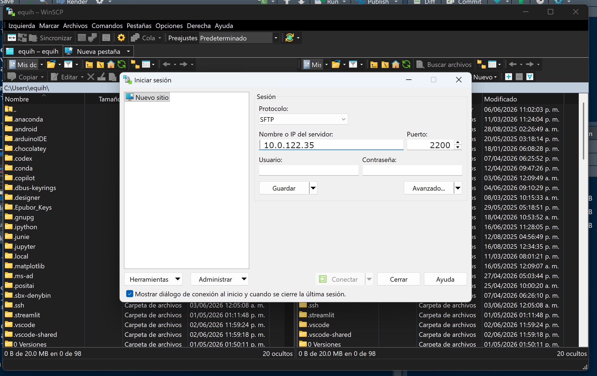
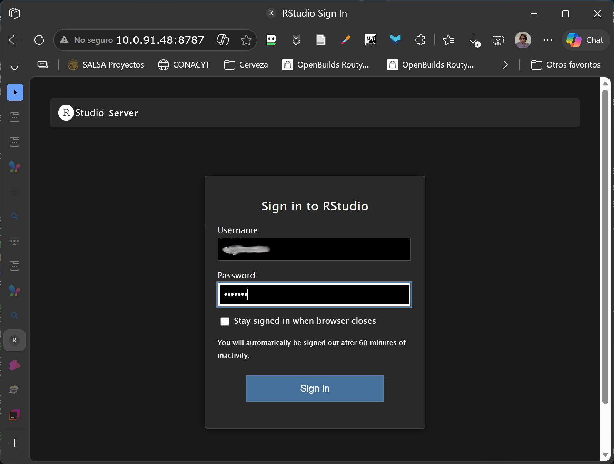

## 1. Introducción y Contexto del Proyecto

Este tutorial establece las pautas de trabajo para homogeneizar variables básicas y expresarlas en formatos ráster congruentes. El flujo está diseñado para operar nativamente en el almacenamiento SSD del servidor centralizado de WSL (`/srv/iie/`) , garantizando que todo el equipo trabaje con las mismas dependencias bajo el entorno compartido `qgis_env`.


### Requisitos Previos en RStudio

Para ejecutar Snakemake desde RStudio en este servidor, nos debemos asegurar de tener el proyecto abierto sobre la ruta de red de WSL y que la terminal local esté usando el intérprete correcto del sistema:

* **Intérprete Python:** `/srv/iie/envs/qgis_env/bin/python3.11` 
* **Librerías principales:** `snakemake`, `sf`, `terra`, `quarto` 

::: {.callout-caution collapse="true"}

### Preparación

Crear el directorio general, asignar acceso al grupo y definir permisos:
>2 → activa setgid, así todos los archivos heredan el grupo iie
>775 → lectura/escritura para dueño y grupo

```bash
# espacio común para el ejericio
sudo mkdir -p /srv/iie-tutor/

# permisos
# asignación a grupo analistas
sudo chown root:analistas /srv/iie-tutor   

# permisos para copartir
sudo chmod 2775 /srv/iie-tutor

# veamos como quedó
ls -ld /srv/iie-tutor

# finalizar agregando "umask 002" al final en profile general
sudo nano /etc/bash.bashrc
```

Dado que trabajaremos en un servidor centralizado sobre WSL, es fundamental que cada usuario mantenga la propiedad y los permisos correctos sobre sus archivos para evitar errores de denegación de acceso (`Permission denied`) al ejecutar las tareas automatizadas.

Para evitar la vulnerabilidad de usar chmod 777 (que permite a cualquier usuario de la red borrar nuestros archivos), hemos configurado el espacio de trabajo `/srv/iie-tutor` utilizando el estándar `POSIX` avanzado para colaboración. La configuración se basa en un trípode de seguridad:

1. **El Grupo Propietario (`chown root:analistas`)**. Al hacer que root sea el dueño, evitamos que un usuario por error borre la carpeta principal. Al asignar el grupo *analistas*, le damos las llaves del reino a nuestro equipo.
2. **La Magia del SetGID (chmod 2775)**. Ese número 2 al principio es el secreto mejor guardado de Linux. Se llama Set Group ID (SGID). Normalmente, si el *Usuario A* crea un archivo, hereda el grupo personal de *Usuario A*. Con el bit `SGID` activado, la carpeta se vuelve un "molde forzado": Cualquier archivo o carpeta que se cree dentro de `/srv/iie-tutor` heredará automáticamente el *grupo analistas* y sus permisos, sin importar quién lo haya creado.
3. **La Máscara de Red (umask 002)**. Por defecto, Linux usa la máscara **022**, lo que significa que los archivos nuevos nacen como lectura/escritura para el creador, pero solo lectura para el resto (**644**).
Al **agregar `umask 002` a `/etc/bash.bashrc`**, obligamos a que todo archivo nuevo nazca con permisos **664** (*Lectura y Escritura para todo el grupo analistas*).Resultado Final: Octavio puede crear un script de R, Martha puede editarlo, y Maricruz puede ejecutarlo, sin que nadie tenga que pedir permisos ni usar `sudo` o **777** jamás.

#### Shell de verificación 

Para simplificarnos la vida y checar que todo está preparado, conviene preparar un script auxiliar (`nano check_iie_env.sh`), con el siguiente contenido. 

```bash
#!/usr/bin/env bash

echo "🔍 Verificando entorno IIE..."

# 1. Usuario
echo "👤 Usuario actual: $USER"

# 2. Grupos
echo "👥 Grupos:"
groups

if groups | grep -q analistas; then
    echo "✅ Usuario pertenece al grupo 'analistas'"
else
    echo "❌ Usuario NO pertenece al grupo 'analistas'"
    echo "   ➜ Ejecuta: sudo usermod -aG analistas $USER"
    echo "   ➜ Luego: exit y vuelve a entrar (o usa newgrp analistas)"
fi

# 3. Directorio
DIR="/srv/iie-tutor"

if [ -d "$DIR" ]; then
    echo "📁 $DIR existe"
else
    echo "❌ $DIR no existe"
fi

# 4. Permisos
echo "🔐 Permisos de $DIR:"
ls -ld $DIR

# 5. Test de escritura
TEST_DIR="$DIR/test-$USER"

echo "🧪 Probando escritura..."

if mkdir "$TEST_DIR" 2>/dev/null; then
    echo "✅ Puedes crear directorios"
    rmdir "$TEST_DIR"
else
    echo "❌ NO puedes escribir en $DIR"
    echo "   Posibles causas:"
    echo "   - No estás en el grupo analistas"
    echo "   - No se ha recargado la sesión"
    echo "   - Permisos incorrectos (usar chmod 2775)"
fi

# 6. Umask
echo "⚙️ Umask actual:"
umask

echo "✅ Verificación terminada"
```

Con permisos de ejecución:

```bash
chmod +x check_iie_env.sh 

# ahora se puede ejecutar
./check_iie_env.sh
```

####  Instalar Quarto en WSL

```bash
# 1. Descargar el instalador oficial de Quarto (versión estable 1.4)
wget https://github.com/quarto-dev/quarto-cli/releases/download/v1.4.555/quarto-1.4.555-linux-amd64.deb

# 2. Instalarlo en el sistema Linux usando privilegios de administrador
sudo dpkg -i quarto-1.4.555-linux-amd64.deb

# 3. Limpiar el instalador para no ocupar espacio en el SSD
rm quarto-1.4.555-linux-amd64.deb

# 4. Verificar que funciona perfectamente
quarto --version
```

#### Habilitar **R** en el entorno compartido qgis_env

Hay que preparar todo lo necesario para que el renderizado con **Quarto** pueda operar los bloques **R** localmente en **WSL**. Para evitar conflictos, montamos una versión apropiada de **R** y aseguramos que los componentes necesarios de *Markdown* y demás bibliotecas estén disponibles directamente dentro del ambiente micromamba geoespacial:


```bash
# 1. Activar el entorno científico compartido
micromamba activate qgis_env

# 2. Instalar R-Base, dependencias de renderizado (Knitr/RMarkdown) y paquetes del tutorial
micromamba install -c conda-forge r-base r-codetools r-knitr r-rmarkdown r-sf r-ggplot2 r-dplyr r-readr r-pacman r-terra r-ragg -y
```

::: 


## 2. Estructura de Archivos del Proyecto

Para que Snakemake funcione de forma automática y ordenada, el repositorio debe mantener la siguiente estructura en (usa tus iniciales para personalizar tu ejemplo) `/srv/iie-tutor/$USER-iie/`:

```text
/srv/iie-tutor/$USER-iie/
├── Snakefile
├── config/
│   └── config.yaml
├── scripts/
│   ├── 1_leer_datos.R
│   ├── 2_construir_tabla.R
│   └── 3_crear_reticula.py
├── plantillas/
├── reportes/
│   └── resumen_atributos.qmd
├── datos/
│   └── registros_base.csv       <-- Coloca aquí tu archivo inicial de datos
├── procesados/                  <-- Destino automático de la Tarea 1
└── resultados/                  <-- Destino automático de las Tareas 2, 3 y 4

```


## 3. Preparación del Área de Trabajo y Permisos


Para los siguientes pasos necesitaras tener acceso cómodo al disco que usaremos todos, en el equipo de Octavio. Una herramienta para lograr esto es [winscpf](https://winscp.net/). Es una aplicación para windows que te mostrará, lado a lado, el directorio local y el del servidor que estamos usando. Una vez que lo tengas instalado, te pedirá los datos de conexión La **IP** local de Octavio es **` 10.0.122.35`**, tus credenciales y listo. Le das conectar y ya está. Debes saber que esta **IP**, no es fija, seguramente cambiará de tiempo en tiempo.




Para este tutorial cada miembro del equipo (Octavio, Martha, Maricruz. Pita) trabajará de forma aislada e independiente en su propio directorio asignado dentro del almacenamiento SSD del servidor. Esto garantiza que puedan experimentar, modificar configuraciones y correr la tubería sin interferir con los demás.


Al usar `$USER` los comandos substituirán esa variable automáticamente por el dato de quién inició la terminal (ej. `martha`, `octavio`, `maricruz`, `pita` o `equihuam`). Lo hará en cualquier comando en el que aparezca.


### Crear directorios desde la terminal.

Abre la pestaña **Terminal** en RStudio y entra a la máquina de Octavio con el protocolo ssh:

```bash
ssh -p 2200 <<tu-user>>@ 10.0.122.35
```

Quizás te diga, ¡cuidado te estas conectando a un equipo que no conoces!, o algo parecido. Si le dices que adelante te pedirá entonces tu clave y si todo va bien, estarás enlazada al equipo de Octavio. Cuando ya estés ahí, ejecuta el siguiente bloque de comandos para construir la estructura base del proyecto:

```bash

#-------------------------------------------------------------------------
# 0. Si les parece cómodo contar con una vaiable de ayuda aí la hacen:

BASE=/srv/iie-tutor/$USER-iie

# Así la usaxrías:
#    mkdir -p $BASE/{config,scripts,reportes,datos,procesados,resultados}
#    cd $BASE
#-------------------------------------------------------------------------

# 1. Crear la carpeta raíz y subdirectorios necesarios
mkdir -p /srv/iie-tutor/$USER-iie/{config,scripts,reportes,datos,plantillas, procesados,resultados}

# 2. Verificar la estructura creada
tree /srv/iie-tutor/$USER-iie/

```

### Básicos de linux

#### Home

No existe tal cosa como una referencia al disco al estilo windows (C:/ o D:/). Todo se reduce a una lista de ubicaciones separadas por `/`. Hay muchas de ellas y por conveniencia sólo habitaremos `/srv/` normalmente, pero quizás quieras saber que eres dueña de tu casa, a la que puedes llegar con `cd ~` es una manera corta de decir *Cambia al Directorio `/home/<<user>>`* puedes crear directorios y archivos ahí con bastante libertad, pero también viven ahí datos de tu configuración particular que conviene no alterar si no estas segura de lo que estás haciendo.

Mostrar el contenido de cualquier directorio se logra con `ls` o con `dir`. No son equivalentes ni sinónimos, son dos programitas distintos. Para fines prácticos el `ls` crudo produce una salida como chorizo, algo incómoda. Sí haces esto `ls -l`, entonces te produce una tabla con columnas y colores bastante informativa y cómoda de interpretar. `dir` normalmente no es colorida y por lo demás se comporta parecido a `ls` varían en su batería de opciones.

#### Copiar y mover

El comando para copiar archivos o directorios es el siguiente:

```bash
cp <origen un archivo, una lista o un directorio> <directorio destino>
```
En la mayoría de los casos con esto tendrás suficiente, pero el comando tiene un montón de opciones, a las que puedes llegar, como con cualquier comando, agregando la opción `--help`. Cuando te interese una lista, basta con anotar lo que quieras separando con espacios. Otra cosa que te puede interesar es cambiar el nombre "al llegar", sólo agrega una diagonal después del directorio de destino y escribe el nuevo nombre.

Mover archivos se opera con el siguiente comando:

```bash
mv <origen> <destino>
```

Es curioso, pero puedes imaginar que este *mover* es en realidad sólo otro manera de decir *cambia el nombre*, si imaginas que el nombre incluye la ubicación. Así, si escribe en `origen` el nombre de un archivo y en `destino` un directorio, el archivo *viajará* a ese nuevo directorio con el mismo nombre. Si escribes dos nombres, entonces obtendrás un nuevo nombre para el origen en el mismo lugar.


### Operar desde un proyecto RStudio  

Instalé en el equipo de Octavio a **R** y **RStudio server** (en Linux no hay una aplicación de escritorio como la de Windows). Esto quiere decir que si te quieres ahorrar lo de RaiDrive, bien podrías hacer todo desde le browser. La forma de activar ese **RStudio** es poner en el navegador la misma **IP** que te funcione para el **ssh** seguido de **:8787**, contesta lo que te pregunte (tus credenciales). ¡Listo!, tendrás frente a ti todo lo necesario para operar el flujo de trabajo.



Me encantará saber cuál de todas las opciones que les he preparado les parece más natural y fácil de operar.


Conviene por muchas razones crear un *Proyecto de RStudio* localizado directamente dentro de la carpeta de Linux que acabas de hacer. Con este proyecto ahí, el panel Files se "anclará" automáticamente a esa ruta cada vez que abras el proyecto. Para construir este espacio en RStudio, ve a File $\rightarrow$ New Project...Selecciona Existing Directory. Haz clic en Browse... y en la barra de direcciones de la ventana que se abre, elige el la unidad RaiDrive que acabas de crear. Dale clic a Create Project y listo. A partir de ahora, RStudio abrirá el panel Files exactamente en esa ruta nativa de WSL, y todos los scripts usarán rutas relativas de manera natural. Si optas por hacerlo con **RStudio servere**, harás lo mismo, pero será más simple, pues ya estas ubicada en la máquina Linux en la que está ocurriendo todo.


## 4. Configuración del `snakemake`

El archivo `config/config.yaml` se usa para especificar los parámetros del modelo sin tener que tocar una sola línea del código de los scripts. Al usar **rutas relativas**, el flujo funcionará perfectamente sin importar qué usuario lo esté corriendo.

```yaml

# Parámetros de Resolución Espacial
resolucion_vectorial: 50000    # Metros (Para la Rama 1: Piloto local)
resolucion_raster: 50000     # Metros (Para la Rama 2: Nacional Big Data - 100km para la prueba)
fondo_oscuro: true

# Insumos y salidas del flujo usando rutas relativas al Snakefile
datos_entrada: "datos/registros_base.csv"

salidas:
  tabla_limpia: "resultados/tabla_atributos.csv"
  gpkg_reticula: "resultados/reticula_variable.gpkg"
  reporte_final: "resultados/reporte_resumen.html"

```


## 5. Orquestación del Flujo: El `Snakefile`

Ubicado en la raíz de tu carpeta (`/srv/iie-tutor/$USER-iie/Snakefile`), este archivo le indica a `Snakemake`  cómo conectar las entradas y salidas de las 4 tareas del ejercicio de capacitación.

```python
 

```


## 6. Scripts de las Tareas 

### Tarea 1: `scripts/1_leer_datos.R`

```{.r}


```


### Tarea 2: `scripts/2_construir_tabla.R`

```{.r}

```


### Tarea 3: `scripts/3_crear_reticula.py`

```python


```


## 7. Documento Quarto para Reporte 

Este documento lee los resultados espaciales intermedios de la simulación para compilar el HTML final. Guarde el documento de abajo aquí: `reportes/resumen_atributos.qmd`

````{text} 



````   


## 8. Ejecución desde RStudio

Para poner en marcha el flujo, abre tu pestaña **Terminal** dentro de RStudio (asegúrate de estar posicionada en `/srv/iie-tutor/$USER-iie/`) y ejecuta:

```bash
# Paso 1: Simulación (Dry-run) para verificar qué tareas faltan o cambiaron
snakemake -n

# Paso 2: Ejecución real utilizando dos núcleos del CPU del servidor
snakemake --cores 2

```

Si posteriormente deseas cambiar el tamaño de celda, modifica el valor numérico en tu `config/config.yaml`, vuelve a lanzar `snakemake --cores 2` y observa cómo el motor recalcula exclusivamente la retícula y el documento Quarto de forma limpia y precisa.


## 9. ¿Cuántos núcleos tenemos disponibles?

El procesador del equipo de Octavio (**Intel Core i7-14700KF**) tiene una arquitectura híbrida moderna. Físicamente cuenta con **20 núcleos** (8 de alto rendimiento y 12 de eficiencia). Sin embargo, gracias a la tecnología Hyper-Threading en los núcleos de rendimiento, el sistema operativo (y por lo tanto WSL y Snakemake) detectan un total de **28 hilos lógicos**.

Para efectos de Snakemake, **tienes hasta 28 núcleos disponibles** (potencial `--cores 28`).


### a) El Cuello de Botella Oculto: La Memoria RAM

Aquí es donde entra la experiencia técnica. Aunque tienes 28 "cerebros" para procesar, **tu límite real son tus 32 GB de RAM**.

En flujos de trabajo geoespaciales con R (usando librerías como `sf`, `terra` o procesando Geopackages), cada vez que Snakemake lanza una tarea en un núcleo nuevo, **R abre una sesión independiente en la memoria**.

* Si una sola tarea de leer mapas y cruzar polígonos consume 2 GB de RAM, y le dices a Snakemake que use `--cores 20`, R intentará consumir 40 GB de RAM de golpe.
* El sistema se quedará sin memoria, WSL entrará en pánico y matará el proceso de Snakemake abruptamente.


### b) ¿Cuántos núcleos conviene utilizar? 

Dado el hardware disponible (28 hilos de CPU y 32 GB de RAM), las recomendaciones para este servidor son:

* **Para capacitación y pruebas del equipo:** `snakemake --cores 2` o `snakemake --cores 4`.
Es perfecto porque los procesos terminarán rápido sin que los usuarios noten ninguna lentitud si están trabajando al mismo tiempo en el servidor.
* **El "Punto Dulce" para el trabajo diario:** `snakemake --cores 8` a `snakemake --cores 10`.
Esto te da un paralelismo masivo (procesarás 10 mapas al mismo tiempo). Asumiendo que cada proceso consuma ~2 GB de RAM, utilizarás unos 20 GB en total. Te sobrarán 12 GB para que Windows y otras aplicaciones funcionen con total fluidez.
* **Modo "Máxima Potencia" (Dejarlo corriendo de noche):** `snakemake --cores 14`.
Utilizar la mitad exacta de tus hilos lógicos es una regla de oro en el modelado geoespacial. Aprovecharás muchísimo el CPU y mantendrás el uso de RAM al borde seguro (cerca de los 28 GB).

**Lo que nunca debes hacer:**
Evita usar `--cores 24` o `--cores 28` a menos que estés corriendo scripts sumamente sencillos (como limpiar texto o mover archivos) que sepas que consumen menos de 500 MB de RAM por proceso.

### c) Un truco extra

Si quieres monitorear en tiempo real cómo se están comportando los núcleos del equipo y la RAM mientras los usuarios corren el tutorial de Snakemake, abre una terminal de WSL y ejecuta el comando `htop`. Verás una gráfica espectacular con las 28 barras del i7 trabajando como una orquesta, y una barra indicando cuánta de tus 32GB de RAM se está llenando.


## 10. Procesar tareas más complejas

### Cambiar el enfoque: Ráster vs Vectorial

Este ejemplo es bueno para apreciar la conveniencia de optar por el formato ráster en lugar del vectorial. En casos de datos grandes (grandes espacios y/o alta resolución). Es un error común seguir la intuición de usar un Geopackage vectorial para guardar una colección de datos referidos a una cuadrícula regular. Una colección vectorial de cuadrados regulares guarda 4 coordenadas completas para cada entidad, además de los datos de topología y  metadatos variados. La cobertura de México completa  a una resolución de 250m tendría un peso estimado de ~15 a 30 GB constituida por unos 31 millones de polígonos. En contraste, un Ráster (GeoTIFF) solo guarda el valor del índice del pixel. La posición espacial se infiere por cálculo simple, referido a la matriz que forma la colección de pixeles. Hagamos un script (`4_crear_raster_regional.py`) que aborde la tarea que ya hicimos en vectores, pero que ahora volveremos a hacer en formato ráster.
  

```python


```


Ahora tienes lo necesario para hacer un nuevo reporte basado en los datos ráster. El documento Quarto que te propongo sería así (guardadlo en: `reportes/resumen_nacional.qmd`):


````{text}


````

Ahora sólo resta ajustar `snakefile` para incorporar las nuevas capacidades.
Con esta nueva opción de cómputo en su lugar, hay que regresar al archivo `snakefile` y actualizarlo para incorporar la nueva capacidad y aprovecharla para producir nuevos resultados. Deberá quedar así:

```python


```

## 11. El Reporte Maestro de Snakemake

Una vez que Snakemake ha procesado exitosamente todos nuestros datos y Quarto ha generado nuestros reportes (\*.html), existe un paso final que con Snakemake resulta muy sencillo de producir: La auto-documentación técnica.

Snakemake puede generar un reporte interactivo final que encapsula:

 + Las estadísticas y tiempos de ejecución. 
 + El código exacto de cada script (\*.R y \*.py) que se usó en esta corrida. 
 + El Grafo Acíclico Dirigido (DAG) interactivo. 
 + Nuestros reportes de Quarto incrustados, gracias a que en nuestro Snakefile marcamos nuestras salidas usando la función report(..., category="Reportes de Integridad").
 
Para *enchular* un poco este reporte se puede preparar un sencillo texto en formato \*.rst, (guárdalo en `reportes/reporte_portada.rst`):

```rst

Auditoría de Ingeniería de Datos:
=================================

Integridad Ecosistémica de México
---------------------------------

Este reporte interactivo fue generado automáticamente por **Snakemake**
para el Programa de Gestión de la Integridad Ecosistémica.


**Propósito del Flujo de Trabajo**
---------------------------------


Este *pipeline* demuestra la capacidad del servidor **Cazahuate** para
procesar datos espaciales a dos escalas distintas de forma simultánea:

1.  **Escala Local (Vectorial):** Agrupamiento de puntos en polígonos
    dentro de un Geopackage.
2.  **Escala Nacional (Big Data Ráster):** Implementación del patrón
    *Scatter-Gather* para particionar, procesar en paralelo y fusionar
    mapas de gran tamaño en formato GeoTIFF.

En la sección lateral izquierda de este documento, bajo la categoría
**Reportes de Integridad**, podrá encontrar los documentos interactivos
de **Quarto** con los resultados cartográficos de ambas corridas.


```

Nuevamente tienes que regresar a tu `snakefile` para registrar esto y habilitar lo necesario para el reporte. Se trata básicamente de agregar la línea que define el reporte y algunas indicaciones de que productos poner en bajo etiquetas accesibles en la página que se producirá Un ejemplo de esto se vería así:


```{.python}


```


Al hacer esto, el comando simple:  `snakemake --report reporte_auditoria_iie.html` leerá automáticamente tu archivo de presentación, tomará el título principal y lo pondrá en la barra superior del navegador, además de colocar tu texto explicativo en la página principal del reporte.


## 12 Cierre: hacer un script complejo

Espero que con el recorrido anterior haya desarrollado una comprensión inicial del concepto de construir un *workflow*. Ahora te propongo hacer algo más complicado y explorar como es que podemos recurrir a la *IA generativa* para desarrollar código que nos sirva. La idea que te propongo es desarrollar un nuevo paso del workflow que nos entregue un proyecto completo y funcional en **QGis**. Lo que haremos ahora es más que ver el código en sí, comentar sobre la secuencia de prompts que nos lleve a tener ese producto. El servidor de Octavio está preparado para 


### Snakemake + PyQGIS + pruebas

La ruta de trabajo que te propongo ahora aborda lo siguiente:

```text
1. Reglas Snakemake
2. Script Python/PyQGIS
3. Pruebas de salida
```

Lo que haré es compartir una secuencia de prompts que usé como parte del proceso del desarrollo de los componentes de código necesarios

#### Prompt 0 — Contexto inicial del trabajo

```text
Estoy trabajando en un workflow geoespacial orquestado con Snakemake. Necesito generar proyectos QGIS reproducibles desde salidas del workflow.

Quiero producir dos variantes:

1. `proyecto_standalone.qgz`
   - Para abrir en QGIS Desktop.
   - Debe incluir layouts editoriales imprimibles.
   - Usa una plantilla QPT.

2. `proyecto_server.qgz`
   - Para ser publicado por QGIS Server.
   - No debe incluir layouts.
   - Debe preparar capas para WMS, WFS y WCS.
   - Debe usar rutas internas esperadas por el entorno servidor, pero sin depender de edición manual en QGIS GUI.

No quiero tocar configuración Docker ni infraestructura. Asume que el servidor ya está configurado. Ayúdame sólo con:
- reglas Snakemake;
- script Python/PyQGIS;
- pruebas de funcionamiento.

Estándar de documentación de scripts:
Todo script Python que generemos o modifiquemos debe incluir un encabezado informativo claro al inicio del archivo, con al menos estas secciones:

1. Descripción
   - Qué hace el script.
   - En qué parte del workflow se usa.
   - Qué problema resuelve.

2. Precondiciones
   - Archivos de entrada esperados.
   - Supuestos sobre nombres de capas, campos, CRS, rutas o entorno.
   - Dependencias relevantes, por ejemplo PyQGIS, GDAL/OGR o ejecución headless.

3. Resultados
   - Archivos de salida generados.
   - Productos esperados para cada modo o parámetro relevante.
   - Criterios mínimos para considerar exitosa la ejecución.

4. Notas relevantes
   - Advertencias técnicas.
   - Decisiones de diseño.
   - Limitaciones conocidas.
   - Casos especiales, si aplica.

Además:
- El código debe estar organizado en funciones reutilizables.
- Debe tener `main()`.
- Debe validar entradas y salidas.
- Debe emitir mensajes claros de avance o error.
- Debe evitar mezclar la lógica `standalone` y `server` cuando puedan mantenerse separadas.
```

Una vez recibido ese *prompt 0* conviene que le especifiques lo siguiente:


```text

Todo script Python generado o modificado debe iniciar con un encabezado informativo con esta estructura:

"""
=============================================================================
<nombre_del_script.py>
-----------------------------------------------------------------------------

Descripción
-----------
<Explicar qué hace el script, en qué parte del workflow se usa y qué problema resuelve.>

Precondiciones
--------------
<Listar entradas esperadas, nombres de capas, campos, CRS, rutas, entorno o dependencias relevantes.>

Resultados
----------
<Listar archivos o productos generados, modos de ejecución y criterios mínimos de éxito.>

Notas relevantes
----------------
<Registrar advertencias técnicas, decisiones de diseño, limitaciones conocidas o casos especiales.>

=============================================================================
"""
```

Con esto habrás sentado las bases para todo el proceso de desarrollo. Ahora, con los siguientes prompts, entraremos en materia.


#### Prompt 1 — Definir dos reglas Snakemake

En este caso yo quise considerar el escenario en el que el Workflow me entregará dos productos derivados de la misma lógica de cómputo. Un primer producto es un **proyecto QGis** plenamente funcional y estético con las capas que quiero, con las paletas que me gusten y además previsión de *layouts para impresión*, adecuados y que cumplan con mis especificaciones precisas. Otro producto muy similar, es también un **proyecto QGis** pero organizado de tal manera que me sirva como base de un servidor de mapas a través de **QGis-server** (que ya lo tenemos habilitado en el servidor de Octavio) Esto me hace pensar que conviene tener dos reglas separadas para especificar la tarea, aunque resulten de correr el mismo script. A mi se me ocurrió llamar a esa dos reglas `create_project_standalone`, `create_project_server` pero tu puedes elegir lo que te resulte más evocativo. También indiqué la sugerencia del nombre del script, que aunque todavía no existe, es el 5° en nuestra secuencia de trabajo en este tutorial y el nombre será a tu gusto de nuevo (nada más no olvide lo que decidas), en mi caso acabé en `create_project_standalone`. Hecha esta reflexión, involucra ahora a tu **IA** y dile:


```text
Ayúdame a definir dos reglas Snakemake separadas para generar proyectos QGIS:

- `create_project_standalone`
- `create_project_server`

Ambas deben llamar al mismo script:

`scripts/5_create_qgis_project.py`

pero con distinto argumento:

- `--target standalone`
- `--target server`

Entradas:

- raster: `resultados/integridad_mexico.tif`
- vector: `resultados/reticula_variable.gpkg`
- plantilla QPT: `plantillas/iie-cartografia.qpt`

Salidas:

- `resultados/proyecto_standalone.qgz`
- `resultados/proyecto_server.qgz`

Quiero reglas claras, independientes, fáciles de forzar con Snakemake, y comandos de prueba para ejecutar cada una por separado.
```

Criterio de validación:

```bash
snakemake --cores 3 --force create_project_standalone --scheduler greedy
snakemake --cores 3 --force create_project_server --scheduler greedy
```


#### Prompt 2 — Construir script mínimo PyQGIS

Ahora vamos a abordar el desarrollo del script 5. Imaginé qu debería dejar la opción abierta a que los ingredientes del proyecto que construira puedan ser variables. Eso significa que hay que preveer que el script acepte argumentos en donde se especifique eso. Como tenemos un producto vectorial y otro ráster, consideré que habría que preveer espacio para canalizar esos dos productos. Estudiando el tema, encontré que es bastante facil lograr hacer mapas bonitos programáticamente con QGis, si cuento con una plantilla a mi gusto, hecha por mi lado. Eso hice y entonces necesito un parámetro para indicarle en dónde tengo la plantilla que quiero que use. Finalmente, quiero tener la libertad de escoger como se llamará el resultado y algo para indicarle que tipo de proceso desarrollará. Con todo esto ya claro, pídele a la **IA** lo siguiente:


```text
Construyamos `scripts/5_create_qgis_project.py` por etapas.

Primero quiero una versión mínima que:

- acepte argumentos:
  - `--raster`
  - `--vector`
  - `--layout-template`
  - `--output`
  - `--target`, con opciones `standalone` y `server`;

- inicialice PyQGIS en modo headless;
- cargue un raster GeoTIFF;
- cargue una capa GeoPackage;
- use la capa interna del GeoPackage llamada `reticula_variable`;
- valide que ambas capas son válidas;
- asigne CRS de proyecto `EPSG:4326`;
- agregue las capas al proyecto;
- coloque el vector arriba y el raster abajo;
- escriba un `.qgz` válido.

No agregues todavía layouts, WMS, WFS ni WCS. Sólo quiero validar carga de capas y escritura del proyecto.
```

Has una corrida de prueba desde tu **terminal SSH**, deberás estar ubicada en /srv/iie-tutor/$USER-iie:

```bash
python scripts/5_create_qgis_project.py \
  --raster resultados/integridad_mexico.tif \
  --vector resultados/reticula_variable.gpkg \
  --layout-template plantillas/iie-cartografia.qpt \
  --output resultados/prueba_minima.qgz \
  --target standalone
```

Si todo resultó bien, ahora tienes una propuesta de script 5 en proceso de desarrollo. Deberas guardarla con el nombre que elegiste en la **carpeta de nuestra estructura canónica: scripts**. Lo siguiente que hice fue resolver como quería que se viera el mapa. Básicamente resolver las paletas de los dos tipos de mapas. Lo hice con algo parecido a la siguiente interacción con la **IA**


## Prompt 3 — Agregar simbología raster y vectorial

```text
Ahora quiero extender el script PyQGIS para aplicar simbología reproducible.

Para el raster:
- usar banda 1;
- calcular mínimo y máximo;
- aplicar una rampa tipo viridis de cinco clases;
- evitar leyendas con valores `nan`;
- asegurar que el renderer quede guardado en el proyecto.

Para el vector:
- buscar el campo de clasificación en este orden:
  1. `integridad_simulada`
  2. `valor_indice`
  3. `valor_iie`

- crear una simbología graduada de cinco clases;
- si no se puede clasificar, usar un símbolo de contorno como respaldo.

Quiero funciones separadas para:
- obtener min/max raster;
- construir renderer raster;
- encontrar campo vectorial;
- construir renderer vectorial;
- aplicar ambos renderers.

No agregues todavía layouts ni configuración server.
```

Como resultado de esta solicitud te entregará la segunda versión del script. Substituye el que ya tienes en la carpeta por esta nueva versión y prúebalo desde tu consola de **Terminal SSH**.

Validación rápida, básicamente :

```bash
unzip -o resultados/prueba_minima.qgz -d /tmp/qgz_test
grep -n "singlebandpseudocolor\|colorrampshader" /tmp/qgz_test/*.qgs
grep -n "graduatedSymbol\|renderer-v2" /tmp/qgz_test/*.qgs
```

---

## Prompt 4 — Construir variante standalone con layouts

```text
Ahora quiero implementar la variante `--target standalone`.

Requisitos:

- Debe generar `resultados/proyecto_standalone.qgz`.
- Debe cargar la plantilla `plantillas/iie-cartografia.qpt`.
- Debe crear dos layouts independientes:
  - `iie-cartografia-raster`
  - `iie-cartografia-vectorial`

Cada layout debe:
- tener una sola página US Letter horizontal;
- conservar la estructura editorial del QPT;
- tener mapa de:
  - ancho: 180 mm
  - alto: 209.4 mm
  - escala: 1:15,000,000
- conservar el encuadre del QPT;
- no autoajustarse al extent de la capa;
- mostrar sólo su capa correspondiente;
- reutilizar la leyenda existente del QPT;
- actualizar el título.

Títulos:
- raster: `Mapa raster de\nintegridad ecosistémica`
- vector: `Mapa vectorial de\nintegridad ecosistémica`

Quiero código modular y que esta lógica sólo corra cuando `--target standalone`.
```

Validación:

```bash
snakemake --cores 3 --force create_project_standalone --scheduler greedy
```

Revisión manual en QGIS Desktop:

```text
- abre proyecto_standalone.qgz;
- existen dos layouts;
- cada layout tiene una página;
- mapa con escala fija;
- leyenda correcta;
- título correcto;
- capas correctas por layout.
```

---

## Prompt 5 — Construir variante server sin layouts

```text
Ahora quiero implementar la variante `--target server`.

Requisitos:

- Debe generar `resultados/proyecto_server.qgz`.
- No debe importar layouts QPT.
- Debe publicar nombres de capa estables:
  - raster: `iie_mapa_raster`
  - vector: `iie_mapa_vectorial`

Debe preparar el proyecto para servicios OGC:

- WMS:
  - raster y vectorial;

- WFS:
  - sólo vectorial;

- WCS:
  - sólo raster.

Importante:
Quiero evitar llamadas PyQGIS frágiles que puedan provocar `SIGSEGV`, especialmente:
- no cambiar datasources a rutas que no existan desde el entorno donde corre PyQGIS;
- no depender de pasos manuales en QGIS GUI.

Propón una arquitectura donde PyQGIS:
1. cargue capas con rutas válidas locales;
2. aplique simbología;
3. escriba un proyecto QGIS válido;
4. y luego, si hace falta, se parchee el `.qgs` interno del `.qgz` como XML para ajustar rutas y propiedades OGC.

Quiero el código de la variante server integrado en el mismo script, manteniendo separada la lógica `standalone` y `server`.
```

Validación:

```bash
snakemake --cores 3 --force create_project_server --scheduler greedy
```

---

## Prompt 6 — Pruebas internas del `.qgz`

```text
Ya se generó `resultados/proyecto_server.qgz`.

Ayúdame a inspeccionar el `.qgz` para verificar que el `.qgs` interno contiene:

- capas con nombres:
  - `iie_mapa_raster`
  - `iie_mapa_vectorial`

- renderer raster:
  - `singlebandpseudocolor`
  - `colorrampshader`

- propiedades OGC:
  - `WMSServiceTitle`
  - `WFSServiceTitle`
  - `WCSServiceTitle`
  - `WFSLayers`
  - `WCSLayers`

Dame comandos `unzip`, `grep` y `sed` para revisar el contenido.
```

Comandos:

```bash
rm -rf /tmp/qgz_server
mkdir -p /tmp/qgz_server
unzip -o resultados/proyecto_server.qgz -d /tmp/qgz_server

grep -n "iie_mapa_raster\|iie_mapa_vectorial" /tmp/qgz_server/*.qgs

grep -n "singlebandpseudocolor\|colorrampshader" /tmp/qgz_server/*.qgs

grep -n "WMSServiceTitle\|WFSServiceTitle\|WCSServiceTitle\|WFSLayers\|WCSLayers" /tmp/qgz_server/*.qgs
```

Para revisar valores internos:

```bash
sed -n '850,900p' /tmp/qgz_server/*.qgs
```

---

## Prompt 7 — Validar WMS

```text
Quiero validar que el proyecto QGIS Server generado por el script funciona correctamente como WMS.

Asume que el servidor ya está configurado y que el endpoint base es:

`http://localhost:8085/cgi-bin/qgis_mapserv.fcgi`

Capas esperadas:
- `iie_mapa_raster`
- `iie_mapa_vectorial`

Dame URLs de prueba para:
- `GetCapabilities`;
- `GetMap` raster;
- `GetMap` vectorial;
- `GetLegendGraphic`.

Usa WMS 1.1.1 en las pruebas `GetMap` con EPSG:4326 para evitar problemas de orden de ejes.
```

---

## Prompt 8 — Validar WCS

```text
Quiero validar WCS para la capa raster `iie_mapa_raster`.

Asume endpoint base:

`http://localhost:8085/cgi-bin/qgis_mapserv.fcgi`

Dame pruebas para:
- `GetCapabilities`;
- `DescribeCoverage`.

Aclara que WCS entrega el raster como cobertura numérica y no necesariamente como mapa estilizado.
```

---

## Prompt 9 — Validar WFS fuera de QGIS GUI

```text
Quiero validar WFS para la capa vectorial `iie_mapa_vectorial` sin depender de QGIS GUI.

Asume endpoint base:

`http://localhost:8085/cgi-bin/qgis_mapserv.fcgi`

Datos esperados:
- capa: `iie_mapa_vectorial`;
- geometría: Polygon;
- feature count: 862;
- campos:
  - `fid`
  - `valor_indice`
  - `integridad_simulada`;
- extent aproximado:
  `(-118.50, 14.33) - (-86.44, 32.77)`.

Dame pruebas con:
- `curl`;
- `grep`;
- `ogrinfo`;
- opcionalmente `ogr2ogr` para exportar a GPKG.

También ayúdame a interpretar avisos de orden de ejes en EPSG:4326.
```

Comandos clave:

```bash
curl -s "http://localhost:8085/cgi-bin/qgis_mapserv.fcgi?SERVICE=WFS&VERSION=1.0.0&REQUEST=GetFeature&TYPENAME=iie_mapa_vectorial" > /tmp/iie_wfs.gml

ls -lh /tmp/iie_wfs.gml
grep -c "gml:featureMember" /tmp/iie_wfs.gml
grep -n "fid" /tmp/iie_wfs.gml | head
```

```bash
ogrinfo -ro \
  "WFS:http://localhost:8085/cgi-bin/qgis_mapserv.fcgi?SERVICE=WFS&VERSION=1.0.0" \
  iie_mapa_vectorial \
  -so
```

---

## Prompt 10 — Diagnóstico de QGIS GUI como cliente WFS

```text
El WFS ya fue validado con `curl` y `ogrinfo`, pero al cargarlo como capa viva en QGIS Desktop puede aparecer incompleto o mostrar avisos de coordenadas.

Ayúdame a distinguir si esto es un problema del servicio o del cliente QGIS GUI.

Considera:
- `forceInitialGetFeature=false`;
- `restrictToRequestBBOX=1`;
- `pagingEnabled=default`;
- `version=auto`;
- render inicial antes de que se complete la lectura de features.

Quiero recomendaciones para usuarios de QGIS Desktop:
- usar WMS para visualización;
- usar WFS para consulta/descarga;
- abrir tabla o exportar para forzar `GetFeature`;
- guardar a GPKG si se va a trabajar localmente;
- probar WFS 1.0.0;
- activar Initial GetFeature si está disponible;
- desactivar restricción por BBOX durante validación.
```

---

## Prompt 11 — Nota final para README o bitácora

```text
Ayúdame a redactar una nota técnica final para README o bitácora.

Debe explicar:

- Se implementaron dos reglas Snakemake separadas:
  - `create_project_standalone`
  - `create_project_server`

- `create_project_standalone` genera un proyecto QGIS Desktop con layouts editoriales desde QPT.

- `create_project_server` genera un proyecto QGIS Server sin layouts y preparado para WMS/WFS/WCS.

- El script Python/PyQGIS se construyó por etapas:
  1. carga y validación de capas;
  2. simbología raster/vectorial;
  3. layouts standalone;
  4. proyecto server;
  5. parche XML del `.qgz` para propiedades OGC cuando fue necesario.

- Se evitó mezclar la lógica Desktop y Server.

- Validaciones:
  - WMS validado como canal de visualización estilizada.
  - WCS validado como cobertura raster numérica.
  - WFS validado como canal vectorial con 862 polígonos, extent correcto y atributos esperados.

- Salvedad:
  - QGIS GUI puede cargar inicialmente una capa WFS viva de forma parcial hasta que una consulta, apertura de tabla o exportación fuerza el `GetFeature` completo. Esto se considera comportamiento del cliente QGIS Desktop, no falla del servicio.
```

---

La versión corta para tus usuarios sería:

```text
No tocar Docker.
Sólo modificar:
1. Snakefile.
2. scripts/5_create_qgis_project.py.
3. Pruebas de salida con Snakemake, unzip/grep, curl y ogrinfo.
```

Y el orden que más protege contra errores es:

```text
Snakemake separado
→ script mínimo
→ simbología
→ standalone
→ server
→ inspección del .qgz
→ WMS
→ WCS
→ WFS
→ nota de cierre
```


------------------


-------------------
Una última etapa es incorporar en Snakefile la producción de un proyecto QGIS completamente funcional. Lo haremos ahora definiendo primero la regla de producción y luego generamos el script necesario para llevarlo a cabo.

Agrega en `snakefile` un nuevo bloque. Lo que describe esta regla es que tomaremos tres componentes: 

1) los datos ráster y vectoriales que produce nuestro flujo de trabajo. 
2) Una propuesta de "plantilla de proyecto" hecha en QGis 3.44 (que es la versión de las librerías que tenemos montadas). 

Con eso, lo que resta es el ensamblado y la integración de metadatos necesarios para que el proyecto sea funcional.


```{.python}

```

Se consolidó una estrategia reproducible para generar proyectos QGIS desde Snakemake sin depender de una plantilla .qgz. El flujo construye el proyecto desde cero con PyQGIS, carga raster y vector desde productos generados por el workflow, aplica simbología por código, importa únicamente una plantilla .qpt para el layout de impresión y produce dos variantes del proyecto: una standalone para revisión en QGIS Desktop y otra server para QGIS Server en Docker.

La versión standalone mantiene las capas con rutas absolutas válidas durante la generación y configura el proyecto para guardar rutas relativas. Esto evita romper la simbología o la leyenda al forzar manualmente rutas relativas con setDataSource(). La versión server sí reescribe las fuentes de datos a rutas absolutas internas del contenedor, usando el prefijo /data.

Para el raster se aplicó una paleta tipo viridis mediante QgsSingleBandPseudoColorRenderer, QgsRasterShader y QgsColorRampShader. La clave para evitar que el raster apareciera inicialmente en gris o que la leyenda mostrara valores nan fue construir el renderer con estadísticas válidas del raster, forzar la clasificación de la rampa con classifyColorRamp(), aplicar el renderer mientras la capa conserva una fuente de datos válida y evitar reload() después de aplicar la simbología.

Para el vector se generó un GeoPackage con esquema estable, incluyendo los campos valor_indice e integridad_simulada, y se aplicó simbología graduada sobre integridad_simulada. La retícula vectorial se mantuvo encima del raster y con transparencia para permitir lectura conjunta.

La arquitectura final separa claramente tres responsabilidades:
1. Datos geoespaciales generados por Snakemake: GeoPackage y GeoTIFF.
2. Proyecto QGIS reproducible: generado por PyQGIS, sin plantilla .qgz heredada.
3. Diseño de impresión: definido por una plantilla .qpt reutilizable.

Productos finales:
- resultados/proyecto_standalone.qgz: proyecto con rutas relativas para QGIS Desktop.
- resultados/proyecto_server.qgz: proyecto con rutas /data/... para QGIS Server en Docker.


El código Python que  acompaña a esta regla se encarga de localizazr y ensamblar en el proyecro QGis las capas deseadas. Cuida de definir el sistema de coordenadas y agrega los metadaros necesarios. Tambipen incluye las previsiones necesarias por si se quisiera utilizar este proyecto como base de datos para entregar mapas mediante [*Web Maping Services* (**WMS**, **WCS** o **WFS**)](https://gisgeography.com/web-mapping-services-wms/), a través de la Web. El código es el siguiente:

```python

```


